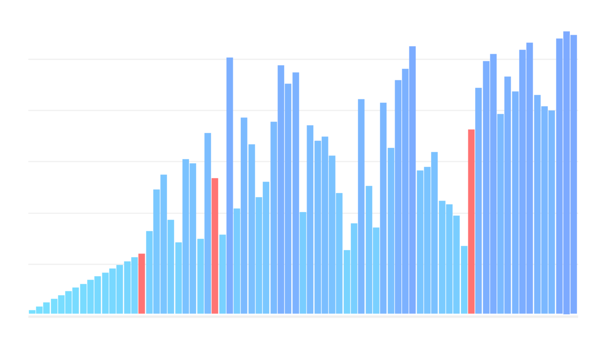

# Sorting Algorithm Visualizer


## Introduction
This is a visualization tool for common sorting algorithms! It intuitively visualizes how sorting algorithms work by displaying the basic operations of a chosen algorithm as it runs on a randomized array. 

## Current Algorithms
The following sorting algorithms have been implemented.

| Sorting Algorithm | Worst-Case Time Complexity | Average-Case Time Complexity | Best-Case Time Complexity |
|:-----------------:|:--------------------------:|:----------------------------:|:-------------------------:|
| Bubble Sort       | O(n<sup>2</sup>)           | O(n<sup>2</sup>)             | O(n)                      |
| Selection Sort    | O(n<sup>2</sup>)           | O(n<sup>2</sup>)             | O(n<sup>2</sup>)          |
| Insertion Sort    | O(n<sup>2</sup>)           | O(n<sup>2</sup>)             | O(n)                      |
| Merge Sort        | O(n log n)                 | O(n log n)                   | O(n log n)                |
| Quick Sort        | O(n<sup>2</sup>)           | O(n log n)                   | O(n log n)                |
| Heap Sort         | O(n log n)                 | O(n log n)                   | O(n log n)                |

As an interesting aside, this visualizer provides decent approximations on how the sorting algorithms would perform relative to each other, so the visualizations of each sorting algorithm should roughly reflect the running time complexities above too.

## Installation
1. Clone this repository to your local machine using `https://github.com/jseok1/Sorting-Algorithm-Visualizer`.
2. Use the package manager `pip` to install `pygame`.
```bash
$ pip install pygame
```

## Usage
To launch the visualizer, simply run the `Main.py` module.

The following keys map to the following algorithms.
* `1` - Bubble Sort
* `2` - Selection Sort
* `3` - Insertion Sort
* `4` - Merge Sort
* `5` - Quick Sort
* `6` - Heap Sort

Additionally, you can press `r` to randomize the array.
